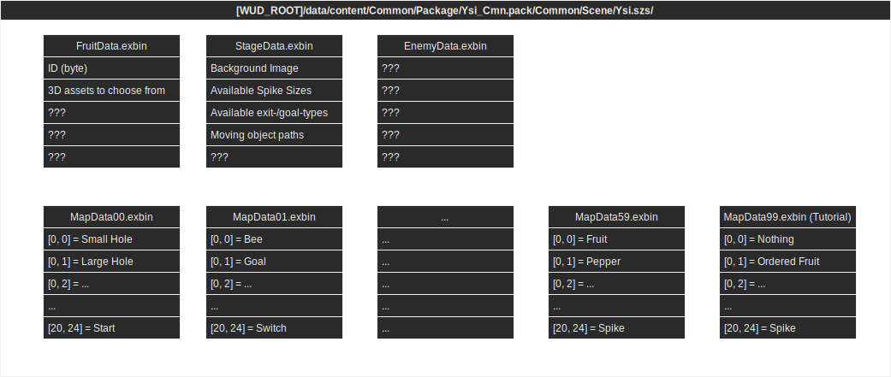
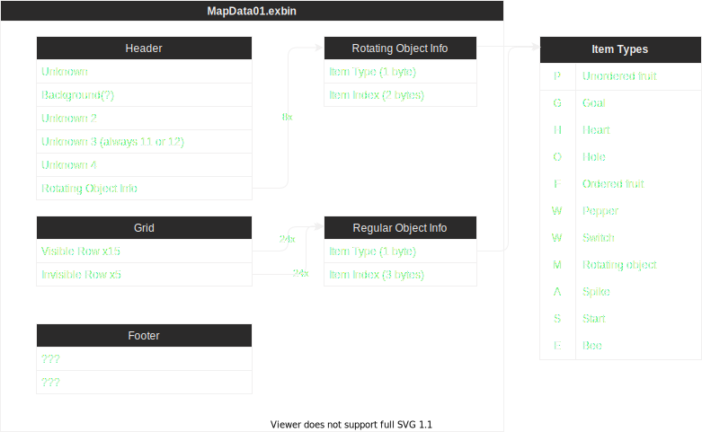

# Game data
This file describes the contents of the files that make up the levels of Yoshi's Fruit Cart.

This image gives an (incomplete) broad overview of what data of Yoshi's Fruit Cart is stored where.

To access this data, follow the steps outlined in the [README.MD](README.MD#to-inspect-the-data-of-a-level-on-hex-basis).



Below is a human readable summary + a reference outline of the body

Game data is split up into two types; **globals** and **maps**.

## Globals
Globals exist once and are constants across all maps.
E.g.: FruitData might define a banana, that restores 20% of the energy bar with the ID 7.
### FruitData [(human-readable)](FruitData.txt) [(grammar)](3_hexgrammar/FruitData.exbin.grammar)
### StageData [(human-readable)](StageData.txt) [(grammar)](3_hexgrammar/StageData.exbin.grammar)
Note: StageData IDs go from 1 to (including) 50. So 50 in total.  
StageData ID 1 however is actually the tutorial stage, which is `MapData99.exbin`. Afterwards, the mapping starts at what the game displays as "level 01".

The mapping is as follows:
| StageData ID | MapData filename  | level number a player will see |
| ------------ | ----------------- | ------------------------------ |
| `1`          | MapData`99`.exbin | Tutorial level                 |
| `2`          | MapData`00`.exbin | Level 01                       |
| `3`          | MapData`01`.exbin | Level 02                       |
| `4`          | MapData`02`.exbin | Level 03                       |
| `...`        | MapData`..`.exbin | Level 04                       |
### EnemyData [(human-readable)](EnemyData.txt) 

## Maps
Maps are stored inside 61 `MapDataXY.exbin` files, with `XY` representing an index starting at 0 and ending at 59.  
Additionally, `MapData99.exbin` is the tutorial stage shown, when a Mii that hasn't played Yoshi's Fruit Cart is selected as the player.
(Adding +1 gives the level number a player will see; `MapData02.exbin` = "Level 03", `MapData03.exbin` = "Level 04", ...)

### MapData [(grammar)](3_hexgrammar/MapData.exbin.grammar)



Maps consist of a header, a grid of [slots](#slots) of **20 rows** and **24 columns** and a footer.  
**Note: Only the first 15 rows are visible by the player.** The purpose of the remaining 5 rows is unknown.  

### Slots
Slots inside the grid can be empty or filled with data.
Slot data consits of 1 byte denoting the [item type](#item-types) and 3 bytes denoting an [index](#slot-indices).

#### Slot indices
Indices inside the games files are NOT stored inside regular signed or unsigned 8-, 16- or  32-bit integers.  
Instead the index will take up all remaining bytes of the slot, is encoded to Little Endian UTF-8 and padded right with `0x00`.
Indices also **start at 1**. E.g.: `P1` referes to the first `1`/[0] unordered fruit `P`, not the fruit offset by 1 (`[1]`=="the second")!

E.g.: A slot wants to reference an unordered fruit (`P`). The index is `0x06` (6). Converted to memory this will be:
```
UTF-8:   P    7    .    .
HEX:     0x50 0x37 0x00 0x00
```
A slot wants to reference a pepper (`W`). The index is `0x0A` (11). Converted to memory this will be:
```
UTF-8:   W    1    2    .
HEX:     0x57 0x31 0x32 0x00
```

To look up the data behind a specific slot:
1. Check the `MapDataXY.exbin` for your level and find the slot you want to look for (i.e. `P1` = an unordered fruit with [index 0](#slot-indices))
2. Find the row indexed `XY` (based on the `MapData` file you opened in Step 1) in `StageData.exbin`
3. Inside that row, find the column for `P1`.
4. The underlying value is `13`, but as [indices](#slot-indices) are one-based, we subtract 1 to receive `12`)
5. Find the row indexed 12 inside `FruitData.exbin` 

#### Item types
##### Unordered fruit (`P`)
##### Goal (`G`)
##### Heart (`H`)
##### Hole (`O`)
##### Ordered fruit (`F`)
##### Pepper / Switch (`W`)
###### Pepper
###### Switch
##### Rotating object (`M`)
##### Spike (`A`)
##### Start (`S`)
##### Bee (`E`)
